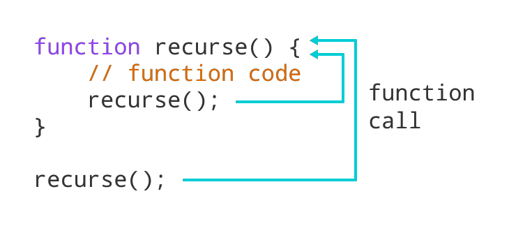
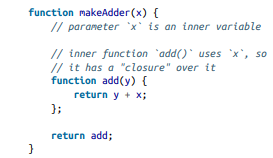
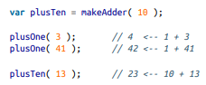
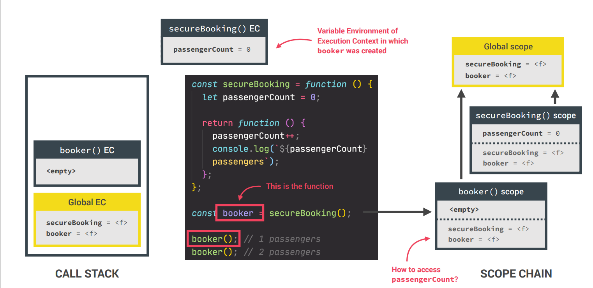

"# lesson2" 

## What is a scope in js ?
 - The scope is the current context of execution in which values and expressions
are "visible" or can be referenced. If a variable or expression is not in the current
scope, it will not be available for use. Scopes can also be layered in a hierarchy, 
so that child scopes have access to parent scopes, but not vice versa

- Global scope: The default scope for all code running in script mode.
-  Function scope: The scope created with a function.
 - Block scope: This scope restricts the variable that is declared 
inside a specific block, from access by the outside of the block.
- Module scope: The scope for code running in module mode.

## The 3 types of scope

# Hoisting in java script

- Hoisting is a JavaScript mechanism where variables and function 
declarations are moved to the top of their scope before code 
execution.

## What is TDZ js ?
- ## Temporal Dead Zone JS?
- A variable declared
with let or const
cannot be accessed
until it is declared
within its scope.

# Hoisting – Variable (var)
- There’s a temptation to think that all of the code you see in a 
JavaScript
program is interpreted line-by-line, top-down in order, as the program
execute. While that is essentially true, there’s one part of that as‐
assumption that can lead to incorrect thinking about your program.

## Hoisting – function declaration
- So, one way of thinking, sort of metaphorically, about this process, is that variable and 
function
declarations are “moved” from where they appear in the flow of the code to the top of the 
code. This gives rise to the name hoisting.

 

 # Temporal dead zone, let and const

 
 

 # What is recursia
 
 - Recursion is when a function calls itself until someone stops it. If no one stops it then it'll 
recurse (call itself) forever. Recursive functions let you perform a unit of work multiple times.
Modern programming languages like JavaScript already have the for and while statements as
alternatives to recursive functions. But some languages like Closure do not have any looping
statements, so you need to use recursion to repeatedly execute a piece of code.

# What is closure
- A closure is the combination of a function bundled together (enclosed) with references to 
its surrounding state (the lexical environment). In other words, a closure gives you 
access to an outer function's scope from an inner function

 

Whether considering JavaScript frameworks or just getting started with the language, we compiled this list to help you pick the best online JavaScript online course. In total, we curated more than a dozen options. When we put our list together, we considered several factors.

